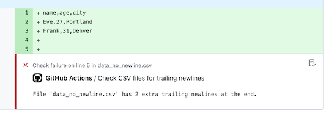

# Check trailing newlines

A linter to check if files contain more than one trailing newline. This will annotate the PR if it finds any matches



Initially intended to check DBT seed csv files. (Empty new line rows ends up as null values in the database)

Can be used to check all non binary files.

**Example for checking all csv files in repo:**
```yaml
    - name: Check trailing newlines in CSV files
      uses: andebor/check-trailing-newlines@main
      with:
        filter_pattern: '*.csv'
        allowed_newlines: 1 # optional, default is 1
```
